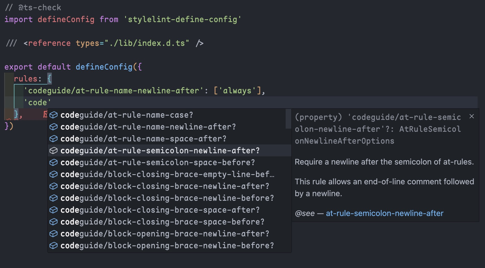

# @stylelint-types/stylelint-codeguide

TypeScript definitions for [stylelint-define-config](https://github.com/stylelint-types/stylelint-define-config).

> [!CAUTION]
> `stylelint-codeguide` has been merged into [`stylelint-stylistic`](https://github.com/stylelint-stylistic/stylelint-stylistic), so this package is deprecated.

## Install

```sh
npm i -D @stylelint-types/stylelint-codeguide
# or
pnpm add -D @stylelint-types/stylelint-codeguide
# or
yarn add -D @stylelint-types/stylelint-codeguide
```

## Usage

```js
// @ts-check
const defineConfig = require('stylelint-define-config')

/// <reference types="@stylelint-types/stylelint-codeguide" />

module.exports = defineConfig({
  rules: {
    // ...rules
  }
})
```



## Credits

- [@stylelint-types](https://github.com/stylelint-types)
- [@pengzhanbo](https://github.com/pengzhanbo)

## LICENSE

[MIT](./LICENSE)
